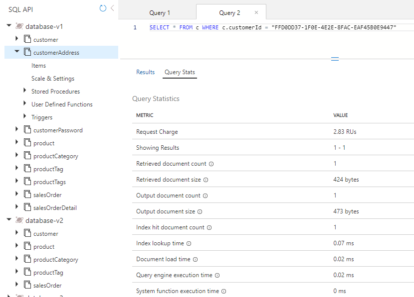

---
lab:
  title: Mesurer les performances des entités clientes
  module: Module 8 - Implement a data modeling and partitioning strategy for Azure Cosmos DB for NoSQL
---

# Mesurer les performances des entités clientes

Dans cet exercice, vous allez mesurer la différence pour les entités relatives aux clients, entre la modélisation des entités en tant que conteneurs distincts et la modélisation d’une base de données NoSQL dans laquelle nous incorporons les entités dans un document unique.

## Préparer votre environnement de développement

Si vous n’avez pas encore cloné le dépôt de code du labo pour le cours **DP-420** dans l'environnement où vous travaillez, suivez ces étapes. Sinon, ouvrez le dossier précédemment cloné dans **Visual Studio Code**.

1. Démarrez **Visual Studio Code**.

    > &#128221; Si vous n'êtes pas familiarisé avec l’interface de Visual Studio Code, consultez le [Guide de démarrage de Visual Studio Code][code.visualstudio.com/docs/getstarted]

1. Ouvrez la palette de commandes et exécutez **Git: Clone** pour cloner le dépôt GitHub ``https://github.com/microsoftlearning/dp-420-cosmos-db-dev`` dans le dossier local de votre choix.

    > &#128161; Vous pouvez utiliser le raccourci clavier **Ctrl+Maj+P** pour ouvrir la palette de commandes.

1. Une fois le dépôt cloné, ouvrez le dossier local que vous avez sélectionné dans **Visual Studio Code**.

1. Dans **Visual Studio Code**, dans le volet **Explorateur**, accédez au dossier **16-measure-performance**.

1. Ouvrez le menu contextuel du dossier **16-measure-performance** et sélectionnez **Ouvrir dans le terminal intégré** pour ouvrir une nouvelle instance de terminal.

1. Si le terminal s’ouvre en tant que terminal **Windows PowerShell**, ouvrez un nouveau terminal **Git Bash**.

    > &#128161; Pour ouvrir un terminal **Git Bash**, à droite du menu du terminal, cliquez sur la liste déroulante à côté du signe **+** et choisissez *Git Bash*.

1. Dans le **terminal Git Bash**, exécutez les commandes suivantes. Les commandes ouvrent une fenêtre de navigateur pour vous connecter au portail Azure où vous utilisez les informations d’identification de labo fournies, exécutez un script qui crée un compte Azure Cosmos DB, puis générez et démarrez l’application que vous utilisez pour remplir la base de données et effectuer les exercices. *Une fois que vous avez entré les informations d’identification fournies pour le compte Azure, la génération peut durer entre 15 et 20 minutes*.

    ```
    "C:\Program Files (x86)\Microsoft SDKs\Azure\CLI2\python.exe" -m pip install pip-system-certs
    az login
    cd 16-measure-performance
    bash init.sh
    dotnet add package Microsoft.Azure.Cosmos --version 3.22.1
    dotnet build
    dotnet run --load-data
    echo "Data load process completed."

    ```

1. Fermez le terminal intégré.

## Mesurer les performances des entités dans des conteneurs distincts

Dans Database-v1, les données sont stockées dans des conteneurs individuels. Dans cette base de données, exécutez les requêtes pour obtenir le client, l’adresse du client et le mot de passe du client. Examinez les frais de demande pour chacune de ces requêtes.

### Requête d’entité customer

Dans Database-v1, exécutez une requête pour obtenir l’entité Customer et examiner les frais liés à la requête.

1. Dans une nouvelle fenêtre ou un nouvel onglet de navigateur web, accédez au portail Azure (``portal.azure.com``).

1. Connectez-vous au portail en utilisant les informations d’identification Microsoft associées à votre abonnement.

1. Dans le menu du portail Azure ou dans la page **Accueil**, sélectionnez **Azure Cosmos DB**.
1. Sélectionnez le compte Azure Cosmos DB dont le nom commence par **cosmicworks**.
1. Sélectionnez **Data Explorer**, à gauche.
1. Développez **Database-v1**.
1. Sélectionnez le conteneur **Customer**.
1. En haut de l’écran, sélectionnez **Nouvelle requête SQL**.
1. Copiez et collez le texte SQL suivant, puis sélectionnez **Exécuter la requête**.

    ```
    SELECT * FROM c WHERE c.id = "FFD0DD37-1F0E-4E2E-8FAC-EAF45B0E9447"
    ```

1. Sélectionnez **Statistiques des requêtes** et remarquez que les frais de demande s’élèvent à 2,83 RU.

    

### Requête d’adresse client

Exécutez une requête pour obtenir l’entité customerAddress et examiner les frais de demande.

1. Sélectionnez le conteneur **CustomerAddress**.
1. En haut de l’écran, sélectionnez **Nouvelle requête SQL**.
1. Copiez et collez le texte SQL suivant, puis sélectionnez **Exécuter la requête**.

    ```
    SELECT * FROM c WHERE c.customerId = "FFD0DD37-1F0E-4E2E-8FAC-EAF45B0E9447"
    ```

1. Sélectionnez **Statistiques des requêtes** et remarquez que les frais de demande s’élèvent à 2,83 RU.

    

### Requête de mot de passe client

Exécutez une requête pour obtenir l’entité customerPassword et examiner les frais de demande.

1. Sélectionnez le conteneur **CustomerPassword**.
1. En haut de l’écran, sélectionnez **Nouvelle requête SQL**.
1. Copiez et collez le texte SQL suivant, puis sélectionnez **Exécuter la requête**.

    ```
    SELECT * FROM c WHERE c.id = "FFD0DD37-1F0E-4E2E-8FAC-EAF45B0E9447"
    ```

1. Sélectionnez **Statistiques des requêtes** et remarquez que les frais de demande s’élèvent à 2,83 RU.

    

### Additionner les frais de demande

Maintenant que nous avons exécuté toutes nos requêtes, nous allons en additionner les coûts en unités de requête.

|**Requête**|**Coût de RU/s**|
|---------|---------|
|Client|2.83|
|Adresse du client|2.83|
|CustomerPassword|2.83|
|**Nombre total de RU/s**|**8,49**|

## Mesurer les performances des entités incorporées

Nous allons à présent demander les mêmes informations, mais avec nos entités incorporées dans un document unique.

1. Sélectionnez la base de données **Database-v2**.
1. Sélectionnez le conteneur **Customer**.
1. Exécutez la requête suivante. 

    ```
    SELECT * FROM c WHERE c.id = "FFD0DD37-1F0E-4E2E-8FAC-EAF45B0E9447"
    ```

1. Remarquez que les données renvoyées prennent maintenant la forme d’une hiérarchie de données de client, adresse et mot de passe.

    

1. Sélectionnez **Statistiques de la requête**. Vous pouvez voir que les frais liés à la requête s’élèvent à 2,83 RU/s, au lieu des 8,49 RU/s pour les trois requêtes que vous avez exécutées précédemment.

## Comparer les performances des deux modèles

Si vous comparez les RU/s de chacune des requêtes que vous avez exécutées, vous pouvez constater que la dernière requête, dans laquelle les entités Customer se trouvent dans un document unique, entraîne un coût beaucoup moins élevé que celui de l’exécution de trois requêtes indépendantes. La latence observée lors du retour de ces données est plus faible, car les données sont retournées en une seule opération.

Lorsque vous recherchez un seul élément et que vous connaissez la clé de partition et l’ID des données, vous pouvez récupérer ces données via un *point de lecture* en appelant `ReadItemAsync()` dans le kit de développement logiciel (SDK) Azure Cosmos DB. Le point de lecture est encore plus rapide que notre requête. Pour les mêmes données client, le coût est simplement de 1 RU/s, soit trois fois moins élevé.

[code.visualstudio.com/docs/getstarted]: https://code.visualstudio.com/docs/getstarted/tips-and-tricks
