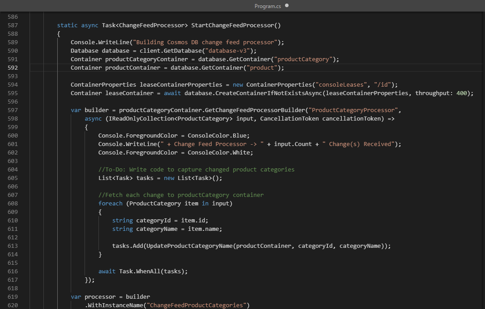
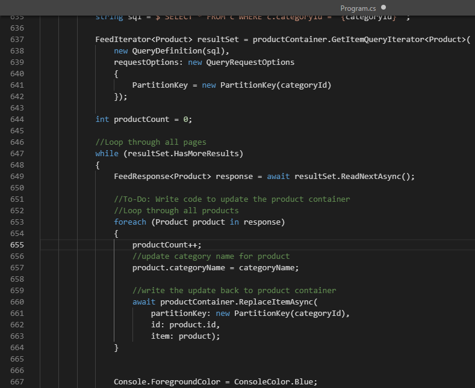
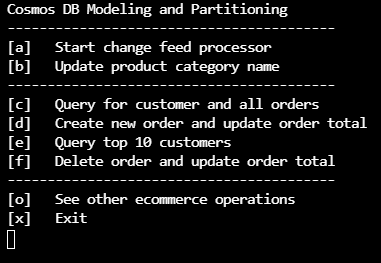
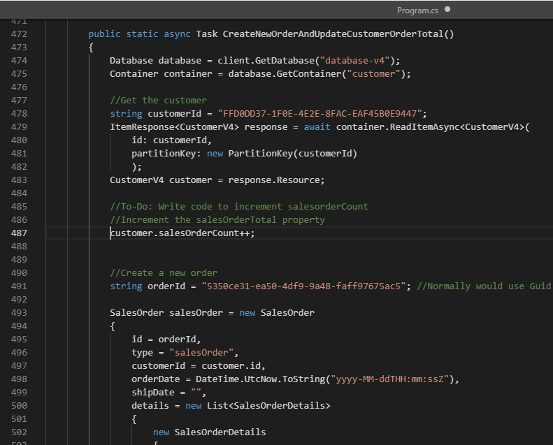

---
lab:
  title: Coût de dénormalisation des données et des agrégats et d’utilisation du flux de modification pour l’intégrité référentielle
  module: Module 8 - Implement a data modeling and partitioning strategy for Azure Cosmos DB for NoSQL
---

# Coût de dénormalisation des données et des agrégats et d’utilisation du flux de modification pour l’intégrité référentielle

L’utilisation du modèle relationnel peut nous permettre de placer différentes entités dans leurs propres conteneurs.  Toutefois, dans les bases de données NoSQL, il n’existe aucune *jointure* entre les conteneurs. Nous devons donc commencer à dénormaliser nos données pour éliminer l’utilisation de *jointures*. En outre, NoSQL réduit le nombre de requêtes en modélisant les données, afin que les applications puissent extraire leurs données avec le plus petit nombre de requêtes possible. Un problème qui se produit lors de la dénormalisation de nos données peut être l’intégrité référentielle entre nos entités. Pour ceci, nous pouvons utiliser le flux de modification pour maintenir les données synchronisées. La dénormalisation vos agrégats en tant que groupe par nombre peut également nous aider à réduire les demandes.  

Dans ce labo, vous allez examiner les avantages de la façon dont dénormaliser les données et les agrégats peut nous aider à réduire les coûts et comment nous pouvons utiliser le flux de modification pour maintenir une intégrité référentielle sur les données dénormalisées.

## Préparer votre environnement de développement

Si vous n’avez pas déjà cloné le référentiel de code labo pour **DP-420** à l’environnement dans lequel vous travaillez sur ce labo, procédez comme suit. Sinon, ouvrez le dossier cloné précédemment dans **Visual Studio Code**.

1. Démarrez **Visual Studio Code**.

    > &#128221 ; Si vous n’êtes pas déjà familiarisé avec l’interface Visual Studio Code, consultez le [Guide de prise en main de Visual Studio Code][code.visualstudio.com/docs/getstarted]

1. Ouvrez la palette de commandes et exécutez **Git: Clone** pour cloner le référentiel GitHub ``https://github.com/microsoftlearning/dp-420-cosmos-db-dev`` dans un dossier local de votre choix.

    > &#128161; Vous pouvez utiliser le raccourci clavier **Ctrl+Maj+P** pour ouvrir la palette de commandes.

1. Une fois le référentiel cloné, ouvrez le dossier local que vous avez sélectionné dans **Visual Studio Code**.

1. Dans **Visual Studio Code**, dans le volet **Explorateur**, accédez au dossier **17-denormalize**.

1. Ouvrez le menu contextuel du dossier **17-denormalize** et sélectionnez **Ouvrir dans le terminal intégré** pour ouvrir une nouvelle instance de terminal.

1. Si le terminal s’ouvre en tant que terminal **Windows PowerShell**, ouvrez un nouveau terminal **Git Bash**.

    > &#128161; Pour ouvrir un terminal **Git Bash**, sur le côté droit du menu du terminal, cliquez sur la liste déroulante en regard du signe **+** et choisissez *Git Bash*.

1. Dans le terminal **Git Bash**, exécutez les commandes qui suivent. Les commandes ouvrent une fenêtre de navigateur pour vous connecter au Portail Azure où vous utiliserez les informations d’identification du labo fournies, exécuterez un script qui crée un nouveau compte Azure Cosmos DB, puis générerez et démarrerez l’application que vous utilisez pour remplir la base de données et effectuer les exercices. *Une fois que vous avez entré les informations d’identification fournies pour le compte Azure, la génération peut prendre de 15 à 20 minutes. C’est peut-être le bon moment pour aller vous chercher un café ou un thé*.

    ```
    "C:\Program Files (x86)\Microsoft SDKs\Azure\CLI2\python.exe" -m pip install pip-system-certs
    az login
    cd 17-denormalize
    bash init.sh
    dotnet add package Microsoft.Azure.Cosmos --version 3.22.1
    dotnet build
    dotnet run --load-data
    echo "Data Load completed."

    ```

1. Fermez le terminal intégré.

## Exercice 1 : mesurer les performances et les coûts pendant la dénormalisation des données

### Rechercher le nom de la catégorie de produit

Dans le conteneur **database-v2**, où les données sont stockées dans des conteneurs individuels, exécutez une requête pour obtenir le nom de la catégorie de produit, puis voir les frais de cette requête.

1. Dans une nouvelle fenêtre ou un nouvel onglet de navigateur web, accédez au Portail Azure (``portal.azure.com``).

1. Connectez-vous au portail en utilisant les informations d’identification Microsoft associées à votre abonnement.

1. Dans le volet gauche, sélectionnez **Azure Cosmos DB**.
1. Sélectionnez le compte Azure Cosmos DB dont le nom commence par **cosmicworks**.
1. Dans le volet gauche, sélectionnez **Explorateur de données**.
1. Développez **database-v2**.
1. Sélectionnez le conteneur **productCategory**.
1. En haut de la page, sélectionnez **Nouvelle requête SQL**.
1. Dans le volet **Requête 1**, collez le code SQL suivant, puis sélectionnez **Exécuter la requête**.

    ```
    SELECT * FROM c where c.type = 'category' and c.id = "AB952F9F-5ABA-4251-BC2D-AFF8DF412A4A"
    ```

1. Sélectionnez l’onglet **Résultats** pour examiner les résultats. Vous voyez que cette requête renvoie le nom de la catégorie de produit, « Components, Headsets ».

    

1. Sélectionnez l’onglet **Statistiques des requêtes** et remarquez les frais de requête de 2,92 RU (unités de requête).

    

### Obtenir les produits de la catégorie

Ensuite, interrogez le conteneur product pour obtenir tous les produits de la catégorie « Components, Headsets ».

1. Sélectionnez le conteneur **product**.
1. En haut de la page, sélectionnez **Nouvelle requête SQL**.
1. Dans le volet **Requête 2**, collez le code SQL suivant, puis sélectionnez **Exécuter la requête**.

    ```
    SELECT * FROM c where c.categoryId = "AB952F9F-5ABA-4251-BC2D-AFF8DF412A4A"
    ```

1. Sélectionnez l’onglet **Résultats** pour examiner les résultats. Vous voyez qu’il y a trois produits renvoyés, HL Headset, LL Headset et ML Headset. Chaque produit a une référence SKU, un nom, un prix et un tableau d’étiquettes de produit.

1. Sélectionnez l’onglet **Statistiques des requêtes** et remarquez les frais de requête de 2,89 RU.

    

### Obtenir les étiquettes de chaque produit

Interrogez ensuite le conteneur productTag trois fois, une fois pour chacun des trois produits : HL Headset, LL Headset et ML Headset.

#### Étiquettes de HL Headset

Commencez par exécuter une requête pour renvoyer les étiquettes de HL Headset.

1. Sélectionnez le conteneur **productTag**.
1. En haut de la page, sélectionnez **Nouvelle requête SQL**.
1. Dans le volet **Requête 3**, collez le code SQL suivant, puis sélectionnez **Exécuter la requête**.

    ```
    SELECT * FROM c where c.type = 'tag' and c.id IN ('87BC6842-2CCA-4CD3-994C-33AB101455F4', 'F07885AF-BD6C-4B71-88B1-F04295992176')
    ```

    Cette requête renvoie les deux étiquettes du produit HL Headset.

1. Sélectionnez **Statistiques des requêtes** et remarquez que les frais de demande s’élèvent à 3,06 RU.

    

#### Étiquettes de LL Headset

Ensuite, exécutez une requête pour renvoyer les étiquettes de LL Headset.

1. Sélectionnez le conteneur **productTag**.
1. En haut de la page, sélectionnez **Nouvelle requête SQL**.
1. Dans le volet **Requête 4**, collez le code SQL suivant, puis sélectionnez **Exécuter la requête**.

    ```
    SELECT * FROM c where c.type = 'tag' and c.id IN ('18AC309F-F81C-4234-A752-5DDD2BEAEE83', '1B387A00-57D3-4444-8331-18A90725E98B', 'C6AB3E24-BA48-40F0-A260-CB04EB03D5B0', 'DAC25651-3DD3-4483-8FD1-581DC41EF34B', 'E6D5275B-8C42-47AE-BDEC-FC708DB3E0AC')
    ```

    Cette requête renvoie les cinq étiquettes du produit LL Headset.

1. Sélectionnez l’onglet **Statistiques des requêtes** et remarquez les frais de requête de 3,45 RU.

    

#### Étiquettes de ML Headset

Enfin, exécutez une requête pour renvoyer les étiquettes de ML Headset.

1. Sélectionnez le conteneur **productTag**.
1. En haut de la page, sélectionnez **Nouvelle requête SQL**.
1. Dans le volet **Requête 5**, collez le code SQL suivant, puis sélectionnez **Exécuter la requête**.

    ```
    SELECT * FROM c where c.type = 'tag' and c.id IN ('A34D34F7-3286-4FA4-B4B0-5E61CCEEE197', 'BA4D7ABD-2E82-4DC2-ACF2-5D3B0DEAE1C1', 'D69B1B6C-4963-4E85-8FA5-6A3E1CD1C83B')
    ```

    Cette requête renvoie les trois étiquettes du produit ML Headset.

1. Sélectionnez l’onglet **Statistiques des requêtes** et remarquez les frais de requête de 3,19 RU.

    

### Additionner les frais de RU

À présent, additionnons les frais de RU de chacune des requêtes que vous avez exécutées.

|**Requête**|**Coût de RU/s**|
|---------|---------|
|Nom de la catégorie|2.92|
|Produit|2.89|
|Étiquettes de produit HL|3,06|
|Étiquettes de produit LL|3.45|
|Étiquettes de produit ML|3,19|
|**Coût total en RU**|**15,51**|

### Exécuter les mêmes requêtes pour votre conception NoSQL

Recherchez les mêmes informations, mais dans la base de données dénormalisée.

1. Dans l’Explorateur de données, sélectionnez **database-v3**.
1. Sélectionnez le conteneur **product**.
1. En haut de la page, sélectionnez **Nouvelle requête SQL**.
1. Dans le volet **Requête 6**, collez le code SQL suivant, puis sélectionnez **Exécuter la requête**.

    ```
   SELECT * FROM c where c.categoryId = "AB952F9F-5ABA-4251-BC2D-AFF8DF412A4A"
   ```

    Les résultats doivent ressembler à ce qui suit :

    

1. Examinez les données renvoyées dans cette requête. Elles contiennent toutes les informations nécessaires pour afficher les produits de cette catégorie, y compris le nom de catégorie et le nom des étiquettes de chacun des trois produits.

1. Sélectionnez l’onglet **Statistiques des requêtes** et remarquez les frais de requête de 2,89 RU.

### Comparer les performances des deux modèles

Dans le modèle relationnel, où les données sont stockées dans des conteneurs individuels, vous avez exécuté cinq requêtes pour obtenir le nom de la catégorie, tous les produits de cette catégorie et toutes les étiquettes de produit de chacun des produits. Les frais de demande des cinq requêtes totalisent 15,56 unités de requête.

Pour obtenir les mêmes informations dans le modèle NoSQL, vous avez exécuté une seule requête et les frais de demande se sont élevés à 2,9 RU.

L’avantage ne se limite pas au coût moindre d’une conception NoSQL comme ce modèle. Ce type de conception est également plus rapide, car il ne nécessite qu’une seule requête. En outre, les données proprement dites sont traitées de la manière dont elles sont susceptibles d’être présentées sur une page Web. Cela signifie moins de code à écrire et à gérer en aval dans votre application d’e-commerce.

Quand vous dénormalisez les données, vous produisez des requêtes plus simples et plus efficaces pour votre application d’e-commerce. Vous pouvez stocker toutes les données nécessaires à votre application dans un conteneur unique et les extraire avec une seule requête. Quand le nombre de requêtes simultanées est élevé, ce type de modélisation des données peut offrir des avantages considérables par sa simplicité, sa rapidité et son coût.

---

## Exercice 2 : utiliser le flux de modification pour gérer l’intégrité référentielle

Dans cet unité, vous verrez comment le flux de modification peut contribuer à maintenir l’intégrité référentielle entre deux conteneurs dans Azure Cosmos DB. Dans ce scénario, vous utilisez le flux de modification pour écouter le conteneur productCategory. Quand vous mettez à jour le nom d’une catégorie de produit, le flux de modification capture le nom mis à jour et met à jour tous les produits de cette catégorie avec le nouveau nom.

Pour cet exercice, vous allez effectuer les étapes suivantes :

- Compléter le code C# pour mettre en évidence les concepts clés qu’il faut comprendre.
- Démarrer le processeur de flux de modification pour qu’il commence l’écoute du conteneur productCategory.
- Exécuter une requête sur le conteneur product pour la catégorie dont vous changez le nom et le nombre de produits de cette catégorie.
- Mettre à jour le nom de catégorie et observer comment le flux de modification propage la modification vers le conteneur product.
- Interroger le nouveau conteneur product avec le nouveau nom de catégorie et comptez le nombre de produits pour vous assurer qu’ils sont tous à jour.
- Rétablir le nom d’origine et observer comment le flux de modification propage à nouveau la modification.

### Démarrer Azure Cloud Shell et ouvrir Visual Studio Code

Pour accéder au code que vous allez mettre à jour pour le flux de modification, procédez comme suit :

1. S’il n’est pas déjà ouvert, ouvrez Visual Studio Code et ouvrez le fichier *Program.cs* dans le dossier *17-denormalize*.

### Compléter le code pour le flux de modification

Ajoutez du code pour gérer les modifications qui sont passées dans le délégué, parcourir chacun des produits de cette catégorie et les mettre à jour.

1. Accédez à la fonction qui démarre le processeur de flux de modification.

1. Sélectionnez CTRL+G, puis tapez **603** pour accéder à cette ligne dans le fichier.

1. Vous devriez maintenant voir le code suivant :

    

   Aux lignes 588 et 589 figurent deux références de conteneur. Vous devez les mettre à jour avec les noms de conteneur appropriés. Le flux de modification fonctionne en créant une instance du processeur de flux de modification sur la référence de conteneur. Dans ce cas, vous observez les modifications du conteneur productCategory.

1. À la ligne 588, remplacez **{container to watch}** par `productCategory`.

1. À la ligne 589, remplacez **{container to update}** par `product`. Quand un nom de catégorie de produit est mis à jour, tous les produits de cette catégorie doivent être mis à jour avec le nouveau nom de catégorie de produit.

1. Sous les lignes *container to watch* et *container to watch*, examinez la ligne *leaseContainer*. Le conteneur leaseContainer fonctionne comme un point de vérification sur le conteneur. Il sait ce qui a été mis à jour depuis la dernière vérification par le processeur de flux de modification.
  
   Quand le flux de modification voit une nouvelle modification, il appelle un délégué et passe les modifications dans une collection en lecture seule.

1. À la ligne 603, vous devez ajouter le code qui sera appelé quand le flux de modification détectera une nouvelle modification qui nécessite d’être traitée. Pour ce faire, copiez l’extrait de code suivant et collez-le sous la ligne qui commence par **//To-Do:**

    ```
    //Fetch each change to productCategory container
    foreach (ProductCategory item in input)
    {
        string categoryId = item.id;
        string categoryName = item.name;
    
        tasks.Add(UpdateProductCategoryName(productContainer, categoryId, categoryName));
    }
    ```

1. À présent, votre code devrait ressembler à celui de l’image suivante :

    

    Par défaut, le flux de modification s’exécute toutes les secondes. Dans les scénarios où il y a beaucoup d’insertions ou de mises à jour dans le conteneur surveillé, le délégué pourrait avoir plusieurs modifications. Pour cette raison, vous tapez l’**entrée**de délégué en tant que **IReadOnlyCollection**.

    Cet extrait de code fait une boucle dans toutes les modifications apportées à l’**entrée** de délégué et les enregistre sous forme de chaînes pour **categoryId** et **categoryName**. Il ajoute ensuite une tâche à la liste de tâches avec un appel à une autre fonction qui met à jour le conteneur product avec le nouveau nom de catégorie.

1. Sélectionnez Ctrl+G, puis entrez **647** pour rechercher votre fonction **UpdateProductCategoryName()**. Ici, vous devez écrire du code qui met à jour chaque produit dans le conteneur product avec le nouveau nom de catégorie capturé par le flux de modification.

1. Copiez l’extrait de code suivant et collez-le sous la ligne qui commence par **//To-Do:**. La fonction fait deux choses. Elle interroge en premier le conteneur produit pour obtenir tous les produits transmis dans **categoryId**. Ensuite, elle met à jour chaque produit avec le nouveau nom de catégorie de produit.

    ```
    //Loop through all products
    foreach (Product product in response)
    {
        productCount++;
        //update category name for product
        product.categoryName = categoryName;
    
        //write the update back to product container
        await productContainer.ReplaceItemAsync(
            partitionKey: new PartitionKey(categoryId),
            id: product.id,
            item: product);
    }
    ```

    Votre code doit désormais ressembler au suivant.

    

    Le code lit les lignes de l’objet response de la requête, puis met à jour le conteneur product avec tous les produits renvoyés par la requête.

    Vous utilisez une boucle **foreach()** pour parcourir chaque produit renvoyé par la requête. Pour chaque ligne, vous mettez à jour un compteur afin de savoir combien de produits ont été mis à jour. Vous mettez ensuite à jour le nom de catégorie du produit vers le nouveau **categoryName**. Enfin, vous appelez **ReplaceItemAsync()** pour remettre à jour le produit dans le conteneur produit.

1. Sélectionnez CTRL+S pour enregistrer vos modifications.

1. S’il n’est pas déjà ouvert, ouvrez un terminal intégré Git Bash et vérifiez que vous êtes sous le dossier *17-denormalize*.

1. Pour compiler et exécuter le projet, exécutez la commande suivante :

    ```
    dotnet build
    dotnet run
    ```

1. L’écran devrait maintenant afficher le menu principal de l’application.

    

### Exécuter l’exemple de flux de modification

Maintenant que vous avez ajouté le code pour le flux de modification, voyons-le en action.

1. Dans le menu principal, sélectionnez **a** pour démarrer le processeur de flux de modification. L’écran affiche la progression.

    

1. Appuyez sur n’importe quelle touche pour revenir au menu principal.

1. Sélectionnez **b** dans le menu principal pour mettre à jour le nom de la catégorie de produit. La séquence suivante se produit :

    a. Il interroge le conteneur products pour obtenir la catégorie « Accessories, Tires, and Tubes » et compte le nombre de produits dans cette catégorie.  
    b. Il met à jour ce nom de catégorie et remplace le mot « and » par une esperluette (&).  
    c. Le flux de modification prend cette modification et, à l’aide du code que vous avez écrit, met à jour tous les produits de cette catégorie.  
    d. Il rétablit le changement de nom et remodifie le nom de catégorie, en remplaçant « & » par le « and » d’origine.  
    e. Le flux de modification prend cette modification et remet à jour tous les produits vers le nom de catégorie de produit d’origine.

1. Sélectionnez **b** dans le menu principal et suivez les invites jusqu’à ce que le flux de modification s’exécute une deuxième fois, puis attendez. Les résultats ressemblent à ce qui suit :

    

1. Si vous avez cliqué trop loin et êtes revenu au menu principal, sélectionnez **b** pour observer les modifications.

1. Une fois que vous avez terminé, tapez **x** pour quitter et revenir à Cloud Shell.

---

## Exercice 3 : dénormalisation d’agrégats

Dans cette unité, vous verrez comment dénormaliser un agrégat pour écrire la requête d’obtention des 10 meilleurs clients pour votre site d’e-commerce. Vous utiliserez la fonctionnalité de traitement par lot transactionnel du kit de développement logiciel (SDK) .NET Azure Cosmos DB qui, simultanément, insère une nouvelle commande et met à jour la propriété **salesOrderCount** du client, les deux étant dans la même partition logique.

Pour cet exercice, vous allez effectuer les étapes suivantes :

- Consulter le code pour créer une commande.
- Compléter le code C# afin d’incrémenter *salesOrderCount* pour le client.
- Compléter le code C# afin d’implémenter la transaction qui permet d’insérer la nouvelle commande et de mettre à jour l’enregistrement du client à l’aide du *traitement par lot transactionnel*.
- Exécuter une requête pour un client spécifique afin de voir l’enregistrement du client et l’ensemble de ses commandes.
- Créer une commande pour ce client et mettre à jour sa propriété **salesOrderCount**.
- Exécuter votre requête d’obtention des 10 meilleurs clients pour voir les résultats actuels.
- Montrer comment vous pouvez utiliser le traitement par lot transactionnel quand un client annule une commande.

## Ouvrez Visual Studio Code.

Pour accéder au code que vous utiliserez dans cette unité, procédez comme suit :

1. S’il n’est pas déjà ouvert, ouvrez Visual Studio Code et ouvrez le fichier *Program.cs* dans le dossier *17-denormalize*.

## Compléter le code pour mettre à jour le total de commandes

1. Accédez à la fonction qui crée une commande.

1. Sélectionnez Ctrl+G, puis tapez **483** pour accéder à cette ligne dans le fichier.

1. Vous devriez maintenant voir le code suivant :

    

    Cette fonction crée une commande et met à jour l’enregistrement du client à l’aide du traitement par lot transactionnel.

    Tout d’abord, l’enregistrement client est récupéré en appelant **ReadItemAsync()** et en transmettant dans **customerId** en tant que clé et ID de partition.

1. À la ligne 483, sous le commentaire **//To-Do:**, incrémentez la valeur de **salesOrderCount**en collant l’extrait de code suivant :

    ```
    //Increment the salesOrderTotal property
    customer.salesOrderCount++;
    ```

    Votre écran doit maintenant ressembler à ceci :

    

## Compléter le code pour implémenter le traitement transactionnel

1. Faites défiler quelques lignes pour voir les données de la nouvelle commande que vous créerez pour votre client.

    Votre nouvel objet salesOrder a un en-tête et une structure détaillée typiques des commandes d’une application d’e-commerce.

    L’en-tête de commande possède **orderId**, **customerId**, **orderDate** et **shipDate**, que vous laisserez vide.

    Votre conteneur client contenant à la fois des entités client et commande, votre objet commande contient également votre propriété de discriminateur, **type**, avec la valeur de **salesOrder**. Cela vous permet de faire la distinction entre une commande client et un objet client dans le conteneur customer.

    Plus loin, vous pouvez également voir les deux produits de la commande qui composent la section des détails de votre commande.

1. Défilez un peu plus loin jusqu’à un autre commentaire **//To-Do:**. Ici, vous devez ajouter du code qui insère une nouvelle commande client et met à jour l’enregistrement du client à l’aide du traitement par lot transactionnel.

1. Copiez l’extrait de code suivant, puis collez-le sur la ligne sous le commentaire **//To-Do:**.

    ```
    TransactionalBatchResponse txBatchResponse = await container.CreateTransactionalBatch(
        new PartitionKey(salesOrder.customerId))
        .CreateItem<SalesOrder>(salesOrder)
        .ReplaceItem<CustomerV4>(customer.id, customer)
        .ExecuteAsync();
    if (txBatchResponse.IsSuccessStatusCode)
        Console.WriteLine("Order created successfully");
    ```

    Ce code appelle **CreateTransactionalBatch()** sur votre objet conteneur. Il prend la valeur de clé de partition comme paramètre obligatoire, car toutes les transactions sont dans la même partition logique. Vous transmettrez votre nouvelle commande en appelant **CreateItem()** et votre objet client mis à jour en appelant **ReplaceItem()**. Ensuite, appelez **ExecuteAsync()** pour exécuter la transaction.

    Pour finir, vérifiez que la transaction a été effectuée en passant en revue l’objet response.

    Votre écran doit maintenant ressembler au suivant :

    

1. Sélectionnez CTRL+S pour enregistrer vos modifications.

1. S’il n’est pas déjà ouvert, ouvrez un terminal intégré Git Bash et vérifiez que vous êtes sous le dossier *17-denormalize*.

1. Pour compiler et exécuter le projet, exécutez la commande suivante :

    ```
    dotnet build
    dotnet run
    ```

1. L’écran devrait maintenant afficher le menu principal de l’application, comme illustré ici :

    

## Rechercher le client et ses commandes

Comme vous avez conçu votre base de données pour stocker le client et toutes ses commandes dans le même conteneur en utilisant **customerId** comme clé de votre partition, vous pouvez interroger le conteneur client et renvoyer l’enregistrement du client et de toutes ses commandes dans une seule opération.

1. Dans le menu principal, sélectionnez **c** pour exécuter l’élément de menu **Query for customer and all orders**. Cette requête renvoie l’enregistrement du client, suivi de toutes les commandes du client. Vous devriez voir la sortie de toutes les commandes du client à l’écran.

   Notez que la dernière commande était **Road-650 Red, 58** d’un montant de 782,99 USD.

1. Faites défiler vers le haut jusqu’à **Print out customer record and all their orders**.

   Remarquez que la propriété **salesOrderCount** affiche deux commandes.

   Votre écran doit ressembler à ce qui suit :

    

## Créer une commande et mettre à jour le total des commandes avec une transaction

Créez une commande pour le même client et mettez à jour le total des commandes enregistrées dans son enregistrement client.

1. Appuyez sur n’importe quelle touche de la fenêtre pour revenir au menu principal.
1. Sélectionnez **d** pour exécuter l’élément de menu correspondant à **Create new order and update order total**.
1. Appuyez sur n’importe quelle touche pour revenir au menu principal.
1. Sélectionnez **c** pour réexécuter la même requête.

   Notez la nouvelle commande montre **HL Mountain Frame – Black, 38** et **Racing Socks, M**.

1. Faites de nouveau défiler vers le haut jusqu’à **Print out customer record and all their orders**.

   Remarquez que la propriété **salesOrderCount** affiche trois commandes.

1. Votre écran doit ressembler à ce qui suit :

    

## Supprimer une commande à l’aide du traitement par lot transactionnel

Comme dans toute application d’e-commerce, les clients annulent également des commandes. Vous pouvez faire la même chose.

1. Appuyez sur n’importe quelle touche pour revenir au menu principal.

1. Sélectionnez **f** pour exécuter l’option de menu **Delete order and update order total**.

1. Appuyez sur n’importe quelle touche pour revenir au menu principal.
1. Sélectionnez **c** pour réexécuter la même requête afin de confirmer la mise à jour de l’enregistrement client.

   Notez que la nouvelle commande n’est plus renvoyée. Si vous défilez vers le haut, vous pouvez voir que la valeur **salesOrderCount** est retournée à **2**.

1. Appuyez sur n’importe quelle touche pour revenir au menu principal.

## Voir le code qui supprime une commande

Vous supprimez une commande client exactement de la même façon que vous en créez une. Les deux opérations sont encapsulées dans une transaction et exécutées dans la même partition logique. Voyons le code qui nous permet de le faire.

1. Tapez **x** pour quitter l’application.
1. S’il n’est pas déjà ouvert, ouvrez Visual Studio Code et ouvrez le fichier *Program.cs* dans le dossier *17-denormalize*.

1. Sélectionnez Ctrl+G, puis entrez **529**.

    Cette fonction supprime la nouvelle commande et met à jour l’enregistrement du client.

    Ici, vous pouvez voir que le code récupère d’abord l’enregistrement client, puis décrémente **salesOrderCount** de 1.

    Puis vient l’appel à **CreateTransactionalBatch()**. Là encore, la valeur de la clé de partition logique est transmise, mais cette fois **DeleteItem()** est appelé avec l’ID de commande et **ReplaceItem()** est appelé avec l’enregistrement client mis à jour.

## Voir le code de votre requête d’obtention des 10 meilleurs clients

Voyons la requête pour obtenir vos 10 meilleurs clients.

1. Sélectionnez Ctrl+G, puis entrez **566**.

    La définition de votre requête se trouve vers le haut.

    ```
    SELECT TOP 10 c.firstName, c.lastName, c.salesOrderCount
        FROM c WHERE c.type = 'customer'
        ORDER BY c.salesOrderCount DESC
    ```

    Cette requête est relativement simple avec une instruction **TOP** pour limiter le nombre d’enregistrements retournés et une clause **ORDER BY** sur votre propriété **salesOrderCount** d’ordre décroissant.

    Remarquez aussi que la propriété de discriminateur **type** avec une valeur de **customer**, pour ne renvoyer que les clients, car votre conteneur client contient à la fois les clients et les commandes.

1. Pour redémarrer l’application si elle n’est pas déjà en cours d’exécution, exécutez la commande suivante :

    ```
    dotnet run
    ```

1. Enfin, tapez **e** pour exécuter la requête.

    

    Vous pouvez ne pas vous rendre compte que la requête d’obtention des 10 meilleurs clients est une requête interpartitions qui traverse toutes les partitions de votre conteneur.

    Le lab associé à celui-ci souligne que vous devez éviter autant que possible les requêtes inter-partitions. Toutefois, en réalité, ces requêtes peuvent fonctionner dans les situations où le conteneur est petit ou si la requête ne s’exécute que peu fréquemment. Si la requête est exécutée souvent ou si le conteneur est exceptionnellement grand, cela peut valoir la peine d’explorer le coût de la matérialisation de ces données dans un autre conteneur et de les utiliser pour traiter cette requête.

[code.visualstudio.com/docs/getstarted]: https://code.visualstudio.com/docs/getstarted/tips-and-tricks
